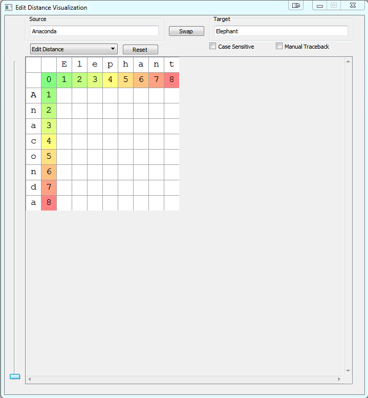

# DPVisualization
Dynamic Programming Visualization Project

## Overview
This project's goal is to provide a **pedantic**, **interactive** visualization for the following introductory dynamic programming problems:
* [Edit Distance](http://en.wikipedia.org/wiki/Edit_distance)
* [Longest Common Subsequence](http://en.wikipedia.org/wiki/Longest_common_subsequence_problem)
* [Maximum Monotone Subsequence](http://en.wikipedia.org/wiki/Longest_increasing_subsequence)

## Implementation
This project is written in **C++** using QT 5.0.4 and was compiled  and MinGW (Windows 7), GCC (Windows 7), and CLANG (OS X 10.9).

## Organization
This project is organized into multiple independent levels of software. The first level contains the implementation of the dynamic programming problems which are not dependent on QT 5.0.4. Each of these problems can be adapted into a second level composed of a *DPMatrix* which is a child of the generic *DisplayGrid*, specialized to work with dynamic programming problems and Qt visualization. Finally, the UI is at the top level and contains an instance of a *DPDisplay* which it uses to display the dynamic programming problem in question.

# GUI Description and Usage
The default GUI is as apears below:

This GUI is driven by user options selected in the top toolbar and by the users selection of a valid cell in the grid directly below.

A description of the following user option is as follows:

**Text Input**
* **Source:** Desribes the vertical string in the grid. The source for the set of visualized dynamic programming problems.
* **Target:** Desribes the horizontal string in the grid. The target for the set of visualized dynamic programming problems.

**Buttons & Checkboxes**
* **Swap:** Swaps the *Source* and *Target* strings and resets the dynamic programming display grid. This feature is not enabled in the M.M.S. problem because the target is always "*0123456789*".
* **Reset:** Resets entries and tracebacks for the dynamic programming grid. The *Source*, *Target*, and other *User Options*.
* **Case Sensitive:** If checked, the dynamic programming problem will be sensitive to case (A == a is *false*). If unchecked, the dynamic programming problem will not be sensitive to case (A == a is *true*). This feature is not enabled in the M.M.S. problem because the target does not contain letters.
* **Manual Traceback:** If checked, the user can perform any valid traceback from any grid cell in the display to the null cell (Top-Left). If unchecked, the dynamic programming problem will automatically perform a valid, optimal traceback and display the result to the user.

**Other**
* **Algorithm Combobox:** Declares which dynamic programming problem the grid should display to the user. If the value is changed, the grid will reset all values to their null state.
